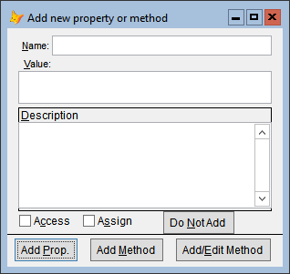
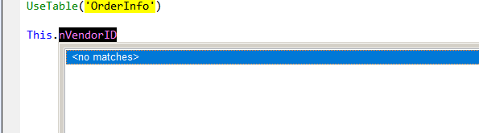

# GoToDefinition

Version 2.14C Released 2023-10-27

[What's new in this release](Change%20Log.md)

*** 

## Table of Contents

*   _[Introduction](#Introduction)_
*   _[What's in a name?](#WhatsInAName)_
*   _[What you can search for](#SearchFor)_
*   _[Where does it look?](#WhereLook)_
*   _[Search Order](#SearchOrder)_
*   _[Adding Properties and Methods](#AddPEMs)_
*   _[Name Conflicts](#NameConflicts)_
*   _[Confusion with "ThisForm" and "This"](#Confusion)_
*   _[Bookmarks - leaving breadcumbs](#Bookmarks)_
*   _[Origins](#Origins)_
*   _[Related News Items](#News)_

## Introduction
Go To Definition (**GTD**), modeled after "Go to Definition" (F12) in Visual Studio, allows you to point to a name that is referenced in your code, and go to (that is, display and/or edit) its definition. It can also be used to create new methods and properties in a form or class.
The mechanics are simple:
* Click on the name (in almost all cases, no need to highlight it.)
* Run **GTD**. 

The intent of **GTD** is that it can search for any name where you can imagine that a definition could be found programmatically; that is, without reading your mind.  And there's no penalty (other than a few wasted seconds) if it's unsuccessful.

### What's in a name?
The “name” that is searched for is determined as follows:
1. All characters to the right of the cursor (or of the selected text, if any) that can be part of a name (letters, numbers, and underscore) are included. 
2. All characters to the left of the cursor (or of the selected text, if any) that can be part of a name, _including periods_, are included. 
3. If the leftmost character is a period and is only preceded by whitespace, then the preceding code is examined looking for WITH statements.  This is done repeatedly, handling embedded WITHs. 

As a result, you can simply click on a name to search for its definition, anywhere from before the first character of the name to after the last character. **GTD** will look for the appropriate property or method even when the reference is inside a WITH/ENDWITH block.

The example below demonstrates all of these rules, as the name being searched for is `This.Frame.Pg1.cboStates`.

#### What you can search for

* Simple names (that look like valid variable names):
	* File name with any of these extensions
		* PRG
		* SCX
		* VCX
		* FRX
	* Name of a procedure or function in a PRG
	* Name of a class
	* Alias of a table that is open
	* Alias of a table that can be opened (possibly augmented by customization)
	* Name of an existing object
	* Name of an object defined by any of:
		* NEWOBJECT
		* CREATEOBJECT
		* LOCAL
	* Constants (from #Include and #Define)
	* Variables (assigned in same procedure)
	* Cursors (created in same procedure)
	* Name of an object defined in Alias Dictionary
	
* VFP Keywords (Click on the keyword -- the first one, if there are two)
	* DO
	* DO FORM
	* REPORT FORM
	* NEWOBJECT
	* CREATEOBJECT
	* LOCAL
	* DEFINE CLASS
 
* THISFORM and THIS (interchangeable)
	* THISFORM
	* THISFORM.SomeProperty
	* THISFORM.SomeNewProperty
	* THISFORM.SomeMethod
	* THISFORM.SomeNewMethod
	* THISFORM.SomeNewMethod(parameters)
	* THISFORM.SomeControl
	* THISFORM.SomeControl.SomePropertyOrMethod
    * THISFORM.SomeControl.SomeNewPropertyOrMethod
 
* Object.MethodName  
    * Name of an object that is open
	* Name of an object defined by any of:
	    * NEWOBJECT
		* CREATEOBJECT
		* LOCAL
	* Name of an object defined in Alias Dictionary
 
* For file names with extensions but no special characters (colon, backslash, spaces, etc.), click on the extension.

* For file names with special characters (colon, backslash, spaces, etc.), the entire file name must be highlighted (with or without the quotes.)

#### Where does it look?

**GTD** looks in many locations, including:
*   The current code window
*   The current folder
*   The search path
*   The active project, if any
*   Thor Tools, Procs, and "My Tools" folders
*   "Set ClassLib"
*   "Set Procedure"
*   #Include files (possibly nested)
*   (and possibly more)

#### Search Order

**GTD** searches in a way similar to how people might search for things --
1. Searches that don't take too long.
2. Searches for things you're most likely to be looking for. 

This is tempered somewhat by a few cases where the searches must be done in a specific order.

#### Creating Properties and Methods

**GTD** provides a number of different ways to add PEMs to a form or class that is being edited:
* `Thisform.newpropertyormethod`
* `Thisform.NewMethod(param1, param2, ...)` && this works if you click immediately after the right parenthesis.  The method is created with the supplied parameters.
* **GTD** when the cursor is in white space in a code window (that is, not on a word)
* **GTD** when not in code window (the form or class being edited, the command window, property window, project manager, and so on)
			
	

**GTD** also works in conjunction with [IntelliSenseX](https://github.com/VFPX/IntelliSenseX).  When you have entered the name of the new property or method, you can use **GTD** directly to go the form for adding the property or method.

			

#### Name Conflicts

In some cases, a name being searched for may not be unique.  You might, for instance have a table named "Admin", as well as a form, report, class, and class library of the same name.  **GTD** will stop searching after the first one it finds.

Such conflicts can be avoided in those instances where the name you are searching for is part of a statement that uses VFP Keywords.  You can point **GTD** in the right direction by clicking on the first keyword in statements like these:
   - DO Admin
   - DO FORM Admin
   - REPORT FORM Admin
   - NEWOBJECT (Admin, 'Admin.vcx')
   - CREATEOBJECT (Admin)
   - LOCAL loObject as Admin of 'Admin.vcx'
   - DEFINE CLASS classname as Admin of 'Admin.vcx'
   
Note that you can open the class library in the examples above by clicking on the file extension or by highlighting the entire file name (with or without quotes).

#### Confusion with "ThisForm" and "This"

Unfortunately, for code windows within VCXs and SCXs, there is not much information that can be gleaned about the origin of the window, other than what is available in the titlebar. **GTD** may misbehave in a couple of different ways due to this problem:
*   If you have more than one VCX or SCX open, it's not possible to determine which VCX or SCX a code window belongs to(!)  **GTD** assumes that it belongs to the "active" one that shows up in PEMEditor or the Property Window.
*   The only information available to understand what "This" refers to is in the method's titlebar. If the name in the titlebar is not unique, **GTD** may use the incorrect object.

Incidentally, these problems also occur in [IntelliSenseX](https://github.com/VFPX/IntelliSenseX).

#### Bookmarks (leaving breadcumbs)
 **GTD** creates bookmarks each time it is used, one placed where **GTD** was invoked and one at its destination (if in a code window).  Two new Thor tools work with these bookmarks:
 * **Cycle Bookmarks** takes you through all your current bookmarks.
 * **Add/Remove BookMark** will add a bookmark at the current location if there isn't one there or remove the current bookmark if there is.
 
 Bookmarks are defined by the window (not its contents) and the cursor position in that window.  They are automatically removed when the window is closed.  Also, they may be out of sync if the code in the window above the bookmark cursor position has been modified.

#### Origins
This project began in early 2010 when Matt Slay suggested to Jim Nelson that a tool Matt had seen in Visual Studio, using F12 for "Go To Definition", might be of value if implemented in FoxPro.  It evolved along a familiar path, with concepts and enhancements coming from continual discussions between Matt and Jim, and eventual implementation by Jim.

> Author's note: I call this tool **"What's This?"** / Jim

[What's new in this release](Change%20Log.md)

----
## Related News Items

**[2014-01-04 : Go To Definition](https://github.com/VFPX/ThorNews/blob/main/NewsItems/Tweet_27.md)**

**[2023-02-05 : Go To Definition Enhancements ](https://github.com/VFPX/ThorNews/blob/main/NewsItems/Item_48.md)** 

**[2023-04-15 : More Go To Definition Enhancements ](https://github.com/VFPX/ThorNews/blob/main/NewsItems/Item_50.md)** 

----
## Helping with this project
See [How to contribute to GoToDefinition](.github/CONTRIBUTING.md) for details on how to help with this project.

Last changed: _2023-04-15_

